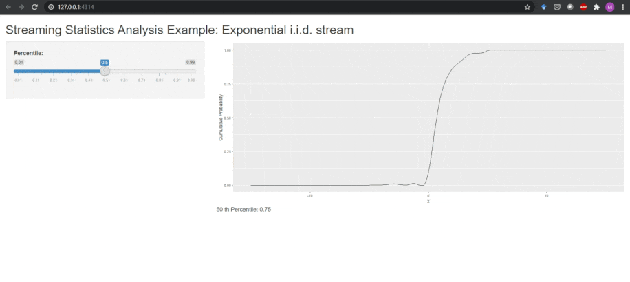
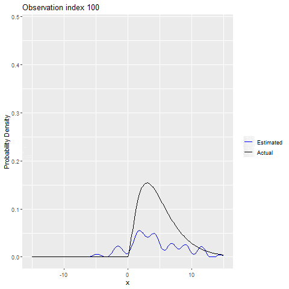

# hermiter

<!-- badges: start -->
[](https://app.codecov.io/gh/MikeJaredS/hermiter)
[](https://cran.r-project.org/package=hermiter)

<!-- badges: end -->


## What does hermiter do?

`hermiter` is an R package that facilitates the estimation of the probability 
density function and cumulative distribution function in univariate and 
bivariate settings using Hermite series based estimators. In addition, 
`hermiter` allows the estimation of the quantile function in the univariate case
and nonparametric correlation coefficients in the bivariate case. The package is
applicable to streaming, batch and grouped data. The core methods of the package
are written in C++ for speed.

These estimators are particularly useful in the sequential setting (both 
stationary and non-stationary data streams). In addition, they are useful in 
efficient, one-pass batch estimation which is particularly relevant in the 
context of large data sets. Finally, the Hermite series based estimators are 
applicable in decentralized (distributed) settings in that estimators formed on 
subsets of the data can be consistently merged. The Hermite series based 
estimators have the distinct advantage of being able to estimate the full 
density function, distribution function and quantile function (univariate 
setting) along with the Spearman Rho and Kendall Tau correlation coefficients
(bivariate setting) in an online manner. The theoretical and empirical 
properties of most of these estimators have been studied in-depth in the 
articles below. The investigations demonstrate that the Hermite series based 
estimators are particularly effective in distribution function, quantile 
function and Spearman correlation estimation.

* [Stephanou, Michael, Varughese, Melvin and Macdonald, Iain. "Sequential quantiles via Hermite series density estimation." Electronic Journal of Statistics 11.1 (2017): 570-607.](https://projecteuclid.org/euclid.ejs/1488531636) 
* [Stephanou, Michael and Varughese, Melvin. "On the properties of hermite series based distribution function estimators." Metrika (2020).](https://link.springer.com/article/10.1007/s00184-020-00785-z)
* [Stephanou, Michael and Varughese, Melvin. "Sequential estimation of Spearman rank correlation using Hermite series estimators." Journal of Multivariate Analysis (2021)](https://www.sciencedirect.com/science/article/pii/S0047259X21000610)

A summary of the estimators and algorithms in `hermiter` can be found in the 
article below.

* [Stephanou, Michael and Varughese, Melvin. "hermiter: R package for Sequential Nonparametric Estimation." Computational Statistics (2023)](https://doi.org/10.1007/s00180-023-01382-0)

## Features

### Univariate

* fast batch estimation of pdf, cdf and quantile function
* consistent merging of estimates
* fast sequential estimation of pdf, cdf and quantile function on streaming data
* adaptive sequential estimation on non-stationary streams via exponential 
weighting
* provides online, O(1) time complexity estimates of arbitrary quantiles e.g. 
median at any point in time along with probability densities and cumulative 
probabilities at arbitrary x
* uses small and constant memory for the estimator
* provides a very compact, simultaneous representation of the pdf, cdf and 
quantile function that can be efficiently stored and communicated using e.g. 
saveRDS and readRDS functions

### Bivariate

* fast batch estimation of bivariate pdf, cdf and nonparametric correlation 
coefficients (Spearman Rho and Kendall Tau)
* consistent merging of estimates
* fast sequential estimation of bivariate pdf, cdf and nonparametric correlation 
coefficients on streaming data
* adaptive sequential estimation on non-stationary bivariate streams via 
exponential weighting
* provides online, O(1) time complexity estimates of bivariate probability 
densities and cumulative probabilities at arbitrary points, x
* provides online, O(1) time complexity estimates of the Spearman and Kendall 
rank correlation coefficients
* uses small and constant memory for the estimator

## Installation

The release version of `hermiter` can be installed from CRAN with:

```r
install.packages("hermiter")
```

The development version of `hermiter` can be installed using `devtools` with:

```r
devtools::install_github("MikeJaredS/hermiter")
```

## Load Package

In order to utilize the hermiter package, the package must be loaded using the 
following command:

```{r}
library(hermiter)
```

## Construct Estimator

A hermite_estimator S3 object is constructed as below. The argument, N, adjusts 
the number of terms in the Hermite series based estimator and controls the 
trade-off between bias and variance. A lower N value implies a higher bias but 
lower variance and vice versa for higher values of N. The argument, standardize,
controls whether or not to standardize observations before applying the 
estimator. Standardization usually yields better results and is recommended 
for most estimation settings. 

A univariate estimator is constructed as follows (note that the default 
estimator type is univariate, so this argument does not need to be explicitly 
set):

```{r}
hermite_est <- hermite_estimator(N=10, standardize=TRUE, 
                                 est_type = "univariate")
```

Similarly for constructing a bivariate estimator:

```{r}
hermite_est <- hermite_estimator(N=10, standardize=TRUE, 
                                 est_type = "bivariate")
```

## Batch Estimator Updating

A hermite_estimator object can be initialized with a batch of observations as 
below.

For univariate observations:

```{r}
observations <- rlogis(n=1000)
hermite_est <- hermite_estimator(N=10, standardize=TRUE, observations = 
                                   observations)
```

For bivariate observations:

```{r}
observations <- matrix(data = rnorm(2000),nrow = 1000, ncol=2)
hermite_est <- hermite_estimator(N=10, standardize=TRUE, 
                                 est_type = "bivariate", observations = 
                                   observations)
```

## Sequential Estimator Updating

In the sequential setting, observations are revealed one at a time. A 
hermite_estimator object can be updated sequentially with a single new 
observation by utilizing the update_sequential method. Note that when updating 
the Hermite series based estimator sequentially, observations are also 
standardized sequentially if the standardize argument is set to true in the 
constructor.

### Standard syntax

For univariate observations:

```{r}
observations <- rlogis(n=1000)
hermite_est <- hermite_estimator(N=10, standardize=TRUE)
for (idx in seq_along(observations)) {
  hermite_est <- update_sequential(hermite_est,observations[idx])
}
```

For bivariate observations:

```{r}
observations <- matrix(data = rnorm(2000),nrow = 1000, ncol=2)
hermite_est <- hermite_estimator(N=10, standardize=TRUE, 
                                 est_type = "bivariate")
for (idx in seq_len(nrow(observations))) {
  hermite_est <- update_sequential(hermite_est,observations[idx,])
}
```

### Piped syntax

For univariate observations:

```{r}
observations <- rlogis(n=1000)
hermite_est <- hermite_estimator(N=10, standardize=TRUE)
for (idx in seq_along(observations)) {
  hermite_est <- hermite_est %>% update_sequential(observations[idx])
}
```

For bivariate observations:

```{r}
observations <- matrix(data = rnorm(2000),nrow = 1000, ncol=2)
hermite_est <- hermite_estimator(N=10, standardize=TRUE, 
                                 est_type = "bivariate")
for (idx in seq_len(nrow(observations))) {
  hermite_est <- hermite_est %>% update_sequential(observations[idx,])
}
```

## Merging Hermite Estimators

Hermite series based estimators can be consistently combined/merged in both
the univariate and bivariate settings. In particular, when standardize = FALSE,
the results obtained from combining/merging distinct hermite_estimators updated 
on subsets of a data set are exactly equal to those obtained by constructing a 
single hermite_estimator and updating on the full data set (corresponding to the 
concatenation of the aforementioned subsets). This holds true for the pdf, cdf 
and quantile results in the univariate case and the pdf, cdf
and nonparametric correlation results in the bivariate case. When standardize = 
TRUE, the equivalence is no longer exact, but is accurate enough to be 
practically useful. Combining/merging hermite_estimators is illustrated below.

For the univariate case:

```{r}
observations_1 <- rlogis(n=1000)
observations_2 <- rlogis(n=1000)
hermite_est_1 <- hermite_estimator(N=10, standardize=TRUE, 
                                   observations = observations_1)
hermite_est_2 <- hermite_estimator(N=10, standardize=TRUE, 
                                   observations = observations_2)
hermite_est_merged <- merge_hermite(list(hermite_est_1,hermite_est_2))
```

For the bivariate case:

```{r}
observations_1 <- matrix(data = rnorm(2000),nrow = 1000, ncol=2)
observations_2 <- matrix(data = rnorm(2000),nrow = 1000, ncol=2)
hermite_est_1 <- hermite_estimator(N=10, standardize=TRUE, 
                                 est_type = "bivariate", 
                                 observations = observations_1)
hermite_est_2 <- hermite_estimator(N=10, standardize=TRUE, 
                                 est_type = "bivariate", 
                                 observations = observations_2)
hermite_est_merged <- merge_hermite(list(hermite_est_1,hermite_est_2))
```

The ability to combine/merge estimators is particularly useful in applications
involving grouped data (see package vignette).

## Estimate univariate pdf, cdf and quantile function

The central advantage of Hermite series based estimators is that they can be 
updated in a sequential/one-pass manner as above and subsequently probability 
densities and cumulative probabilities at arbitrary x values can be obtained, 
along with arbitrary quantiles. The hermite_estimator object only maintains a 
small and fixed number of coefficients and thus uses minimal memory. The syntax 
to calculate probability densities, cumulative probabilities and quantiles in 
the univariate setting is presented below.

### Standard syntax

```{r}
observations <- rlogis(n=2000)
hermite_est <- hermite_estimator(N=10, standardize=TRUE, 
                                 observations = observations)

x <- seq(-15,15,0.1)
pdf_est <- dens(hermite_est,x)
cdf_est <- cum_prob(hermite_est,x)

p <- seq(0.05,1,0.05)
quantile_est <- quant(hermite_est,p)
```

### Piped syntax

```{r}
observations <- rlogis(n=2000)
hermite_est <- hermite_estimator(N=10, standardize=TRUE, 
                                 observations = observations)

x <- seq(-15,15,0.1)
pdf_est <- hermite_est %>% dens(x)
cdf_est <- hermite_est %>% cum_prob(x)

p <- seq(0.05,0.95,0.05)
quantile_est <- hermite_est %>% quant(p)
```

```{r}
actual_pdf <- dlogis(x)
actual_cdf <- plogis(x)
df_pdf_cdf <- data.frame(x,pdf_est,cdf_est,actual_pdf,actual_cdf)

actual_quantiles <- qlogis(p)
df_quant <- data.frame(p,quantile_est,actual_quantiles)
```

### Comparing Estimated versus Actual

```{r}
ggplot(df_pdf_cdf,aes(x=x)) + geom_line(aes(y=pdf_est, colour="Estimated")) +
  geom_line(aes(y=actual_pdf, colour="Actual")) +
  scale_colour_manual("", 
                      breaks = c("Estimated", "Actual"),
                      values = c("blue", "black")) + ylab("Probability Density")
```


```{r}
ggplot(df_pdf_cdf,aes(x=x)) + geom_line(aes(y=cdf_est, colour="Estimated")) +
  geom_line(aes(y=actual_cdf, colour="Actual")) +
  scale_colour_manual("", 
                      breaks = c("Estimated", "Actual"),
                      values = c("blue", "black")) +
  ylab("Cumulative Probability")
```


```{r}
ggplot(df_quant,aes(x=actual_quantiles)) + geom_point(aes(y=quantile_est),
                                                      color="blue") +
  geom_abline(slope=1,intercept = 0) +xlab("Theoretical Quantiles") +
  ylab("Estimated Quantiles")
```


### Convenience functions

Note that there are also generic methods facilitating summarizing and plotting
univariate densities and distribution functions as illustrated below.

```{r}
h_dens <- density(hermite_est)
print(h_dens)
plot(h_dens)
```


```{r}
h_cdf <- hcdf(hermite_est)
print(h_cdf)
plot(h_cdf)
summary(h_cdf)
```


Finally there are the following convenience functions providing familiar syntax
to the ordinary R functions.

```{r}
quantile(hermite_est)

median(hermite_est)

IQR(hermite_est)
```


## Estimate bivariate pdf, cdf and nonparametric correlation

The aforementioned suitability of Hermite series based estimators in sequential 
and one-pass batch estimation settings extends to the bivariate case. 
Probability densities and cumulative probabilities can be obtained at arbitrary 
points. The syntax to calculate probability densities and  
cumulative probabilities along with the Spearman and Kendall correlation 
coefficients in the bivariate setting is presented below.

### Standard syntax

```{r}
# Prepare bivariate normal data
sig_x <- 1
sig_y <- 1
num_obs <- 4000
rho <- 0.5
observations_mat <- mvtnorm::rmvnorm(n=num_obs,mean=rep(0,2),
          sigma = matrix(c(sig_x^2,rho*sig_x*sig_y,rho*sig_x*sig_y,sig_y^2), 
          nrow=2,ncol=2, byrow = TRUE))

hermite_est <- hermite_estimator(N = 30, standardize = TRUE, 
                                 est_type = "bivariate", 
                                 observations = observations_mat) 
vals <- seq(-5,5,by=0.25)
x_grid <- as.matrix(expand.grid(X=vals, Y=vals))
pdf_est <- dens(hermite_est,x_grid)
cdf_est <- cum_prob(hermite_est,x_grid)
spear_est <- spearmans(hermite_est)
kendall_est <- kendall(hermite_est)
```

### Piped syntax

```{r}
sig_x <- 1
sig_y <- 1
num_obs <- 4000
rho <- 0.5
observations_mat <- mvtnorm::rmvnorm(n=num_obs,mean=rep(0,2),
        sigma = matrix(c(sig_x^2,rho*sig_x*sig_y,rho*sig_x*sig_y,sig_y^2), 
          nrow=2, ncol=2, byrow = TRUE))

hermite_est <- hermite_estimator(N = 30, standardize = TRUE, 
                                 est_type = "bivariate", 
                                 observations = observations_mat) 

vals <- seq(-5,5,by=0.25)
x_grid <- as.matrix(expand.grid(X=vals, Y=vals))
pdf_est <- hermite_est %>% dens(x_grid, clipped = TRUE)
cdf_est <- hermite_est %>% cum_prob(x_grid, clipped = TRUE)
spear_est <- hermite_est %>% spearmans()
kendall_est <- hermite_est %>% kendall()
```

```{r}
actual_pdf <-mvtnorm::dmvnorm(x_grid,mean=rep(0,2),
            sigma = matrix(c(sig_x^2,rho*sig_x*sig_y,rho*sig_x*sig_y,sig_y^2), 
                           nrow=2,ncol=2, byrow = TRUE))
actual_cdf <- rep(NA,nrow(x_grid))
for (row_idx in seq_len(nrow(x_grid))) {
  actual_cdf[row_idx] <-  mvtnorm::pmvnorm(lower = c(-Inf,-Inf),
    upper=as.numeric(x_grid[row_idx,]),mean=rep(0,2),sigma = matrix(c(sig_x^2, 
        rho*sig_x*sig_y,rho*sig_x*sig_y,sig_y^2), nrow=2,ncol=2,byrow = TRUE))
}
actual_spearmans <- cor(observations_mat,method = "spearman")[1,2]
actual_kendall <- cor(observations_mat,method = "kendall")[1,2]
df_pdf_cdf <- data.frame(x_grid,pdf_est,cdf_est,actual_pdf,actual_cdf)
```

### Comparing Estimated versus Actual

```{r}
p1 <- ggplot(df_pdf_cdf) + geom_tile(aes(X, Y, fill= actual_pdf)) +
  scale_fill_continuous_sequential(palette="Oslo",
                                   breaks=seq(0,.2,by=.05),
                                   limits=c(0,.2))

p2 <- ggplot(df_pdf_cdf) + geom_tile(aes(X, Y, fill= pdf_est)) +
  scale_fill_continuous_sequential(palette="Oslo",
                                   breaks=seq(0,.2,by=.05),
                                   limits=c(0,.2))

p1+ ggtitle("Actual PDF")+ theme(legend.title = element_blank()) + p2 +
  ggtitle("Estimated PDF") +theme(legend.title = element_blank()) +
  plot_layout(guides = 'collect')
```


```{r}
p1 <- ggplot(df_pdf_cdf) + geom_tile(aes(X, Y, fill= actual_cdf)) +
  scale_fill_continuous_sequential(palette="Oslo",
                       breaks=seq(0,1,by=.2),
                       limits=c(0,1))

p2 <- ggplot(df_pdf_cdf) + geom_tile(aes(X, Y, fill= cdf_est)) +
  scale_fill_continuous_sequential(palette="Oslo",
                                   breaks=seq(0,1,by=.2),
                                   limits=c(0,1))

p1+ ggtitle("Actual CDF") + theme(legend.title = element_blank()) + p2 +
  ggtitle("Estimated CDF") + theme(legend.title = element_blank())+
  plot_layout(guides = 'collect')
```


Spearman's correlation coefficient results:

|             | Spearman's Correlation |
| ----------- | ----------- |
| Actual      | 0.453       |
| Estimated   | 0.447        |

Kendall correlation coefficient results:

|             | Kendall Correlation |
| ----------- | ----------- |
| Actual      | 0.312       |
| Estimated   | 0.308        |

## Applying to stationary data (sequential setting)

### Univariate Example

Another useful application of the hermite_estimator class is to obtain pdf, cdf 
and quantile function estimates on streaming data. The speed of estimation 
allows the pdf, cdf and quantile functions to be estimated in real time. We 
illustrate this below for cdf and quantile estimation with a sample Shiny 
application. We reiterate that the particular usefulness is that the full pdf, 
cdf and quantile functions are updated in real time. Thus, any arbitrary 
quantile can be evaluated at any point in time. We include a stub for reading 
streaming data that generates micro-batches of standard exponential i.i.d. 
random data. This stub can easily be swapped out for a method reading 
micro-batches from a Kafka topic or similar.

The Shiny sample code below can be pasted into a single app.R file and run 
directly.

```{r eval=FALSE}
# Not Run. Copy and paste into app.R and run.
library(shiny)
library(hermiter)
library(ggplot2)
library(magrittr)

ui <- fluidPage(
    titlePanel("Streaming Statistics Analysis Example: Exponential 
               i.i.d. stream"),
    sidebarLayout(
        sidebarPanel(
            sliderInput("percentile", "Percentile:",
                        min = 0.01, max = 0.99,
                        value = 0.5, step = 0.01)
        ),
        mainPanel(
           plotOutput("plot"),
           textOutput("quantile_text")
        )
    )
)

server <- function(input, output) {
    values <- reactiveValues(hermite_est = 
                                 hermite_estimator(N = 10, standardize = TRUE))
    x <- seq(-15, 15, 0.1)
    # Note that the stub below could be replaced with code that reads streaming 
    # data from various sources, Kafka etc.  
    read_stream_stub_micro_batch <- reactive({
        invalidateLater(1000)
        new_observation <- rexp(10)
        return(new_observation)
    })
    updated_cdf_calc <- reactive({
        micro_batch <- read_stream_stub_micro_batch()
        for (idx in seq_along(micro_batch)) {
            values[["hermite_est"]] <- isolate(values[["hermite_est"]]) %>%
                update_sequential(micro_batch[idx])
        }
        cdf_est <- isolate(values[["hermite_est"]]) %>%
            cum_prob(x, clipped = TRUE)
        df_cdf <- data.frame(x, cdf_est)
        return(df_cdf)
    })
    updated_quantile_calc <- reactive({
        values[["hermite_est"]]  %>% quant(input$percentile)
    })
    output$plot <- renderPlot({
        ggplot(updated_cdf_calc(), aes(x = x)) + geom_line(aes(y = cdf_est)) +
            ylab("Cumulative Probability")
    }
    )
    output$quantile_text <- renderText({ 
        return(paste(input$percentile * 100, "th Percentile:", 
                     round(updated_quantile_calc(), 2)))
    })
}
shinyApp(ui = ui, server = server)
```



## Applying to non-stationary data (sequential setting)

### Univariate Example

The hermite_estimator is also applicable to non-stationary data streams.
A weighted form of the Hermite series based estimator can be applied to handle 
this case. The estimator will adapt to the new distribution and 
"forget" the old distribution as illustrated in the example below. In this 
univariate example, the  distribution from which the observations are drawn 
switches from a Chi-square distribution to a logistic distribution and finally 
to a normal distribution. In order to use the exponentially weighted form of the 
hermite_estimator, the exp_weight_lambda argument must be set to a non-NA value.
Typical values for this parameter are 0.01, 0.05 and 0.1. The lower the 
exponential weighting parameter, the slower the estimator adapts and vice versa 
for higher values of the parameter. However, variance increases with higher 
values of exp_weight_lambda, so there is a trade-off to bear in mind.

```{r}
# Prepare Test Data
num_obs <-2000
test <- rchisq(num_obs,5)
test <- c(test,rlogis(num_obs))
test <- c(test,rnorm(num_obs))
```

```{r}
# Calculate theoretical pdf, cdf and quantile values for comparison
x <- seq(-15,15,by=0.1)
actual_pdf_lognorm <- dchisq(x,5)
actual_pdf_logis <- dlogis(x)
actual_pdf_norm <- dnorm(x)
actual_cdf_lognorm <- pchisq(x,5)
actual_cdf_logis <- plogis(x)
actual_cdf_norm <- pnorm(x)
p <- seq(0.05,0.95,by=0.05)
actual_quantiles_lognorm <- qchisq(p,5)
actual_quantiles_logis <- qlogis(p)
actual_quantiles_norm <- qnorm(p)
```

```{r}
# Construct Hermite Estimator 
h_est <- hermite_estimator(N=20,standardize = TRUE,exp_weight_lambda = 0.005)
```

```{r}
# Loop through test data and update h_est to simulate observations arriving 
# sequentially
count <- 1
res <- data.frame()
res_q <- data.frame()
for (idx in seq_along(test)) {
  h_est <- h_est %>% update_sequential(test[idx])
  if (idx %% 100 == 0){
    if (floor(idx/num_obs)==0){
      actual_cdf_vals <- actual_cdf_lognorm
      actual_pdf_vals <-actual_pdf_lognorm
      actual_quantile_vals <- actual_quantiles_lognorm
    }
    if (floor(idx/num_obs)==1){
      actual_cdf_vals <- actual_cdf_logis
      actual_pdf_vals <-actual_pdf_logis
      actual_quantile_vals <- actual_quantiles_logis
    }
    if (floor(idx/num_obs)==2){
      actual_cdf_vals <- actual_cdf_norm
      actual_pdf_vals <- actual_pdf_norm
      actual_quantile_vals <- actual_quantiles_norm
    }
    idx_vals <- rep(count,length(x))
    cdf_est_vals <- h_est %>% cum_prob(x, clipped=TRUE)
    pdf_est_vals <- h_est %>% dens(x, clipped=TRUE)
    quantile_est_vals <- h_est %>% quant(p)
    res <- rbind(res,data.frame(idx_vals,x,cdf_est_vals,actual_cdf_vals,
                                pdf_est_vals,actual_pdf_vals))
    res_q <- rbind(res_q,data.frame(idx_vals=rep(count,length(p)),p,
                                    quantile_est_vals,actual_quantile_vals))
    count <- count +1
  }
}
res <- res %>% mutate(idx_vals=idx_vals*100)
res_q <- res_q %>% mutate(idx_vals=idx_vals*100)
```

```{r eval=FALSE}
# Visualize Results for PDF (Not run, requires gganimate, gifski and transformr
# packages)
p <- ggplot(res,aes(x=x)) + geom_line(aes(y=pdf_est_vals, colour="Estimated")) +
geom_line(aes(y=actual_pdf_vals, colour="Actual")) +
  scale_colour_manual("", 
                      breaks = c("Estimated", "Actual"),
                      values = c("blue", "black")) + 
            ylab("Probability Density") +
            transition_states(idx_vals,transition_length = 2,state_length = 1) +
  ggtitle('Observation index {closest_state}')
anim_save("pdf.gif",p)
```



```{r eval=FALSE}
# Visualize Results for CDF (Not run, requires gganimate, gifski and transformr
# packages)
p <- ggplot(res,aes(x=x)) + geom_line(aes(y=cdf_est_vals, colour="Estimated")) +
geom_line(aes(y=actual_cdf_vals, colour="Actual")) +
  scale_colour_manual("", 
                      breaks = c("Estimated", "Actual"),
                      values = c("blue", "black")) +
  ylab("Cumulative Probability") + 
  transition_states(idx_vals, transition_length = 2,state_length = 1) +
  ggtitle('Observation index {closest_state}')
anim_save("cdf.gif", p)
```


```{r eval=FALSE}
# Visualize Results for Quantiles (Not run, requires gganimate, gifski and 
# transformr packages)
p <- ggplot(res_q,aes(x=actual_quantile_vals)) +
  geom_point(aes(y=quantile_est_vals), color="blue") +
  geom_abline(slope=1,intercept = 0) +xlab("Theoretical Quantiles") +
  ylab("Estimated Quantiles") + 
  transition_states(idx_vals,transition_length = 2, state_length = 1) +
  ggtitle('Observation index {closest_state}')
anim_save("quant.gif",p)
```


### Bivariate Example

We illustrate tracking a non-stationary bivariate data stream with another 
sample Shiny application. The bivariate Hermite estimator leverages an 
exponential weighting scheme as described in the univariate case and does not 
need to maintain a sliding window. We include a stub for reading streaming data 
that generates micro-batches of bivariate normal i.i.d. random data with a 
chosen Spearman's correlation coefficient (as this is easily linked to the 
standard correlation matrix). This stub can again be readily swapped out for a 
method reading micro-batches from a Kafka topic or similar.

The Shiny sample code below can be pasted into a single app.R file and run 
directly.

```{r eval=FALSE}
# Not Run. Copy and paste into app.R and run.
library(shiny)
library(hermiter)
library(ggplot2)
library(magrittr)

ui <- fluidPage(
  titlePanel("Bivariate Streaming Statistics Analysis Example"),
  sidebarLayout(
    sidebarPanel(
      sliderInput("spearmans", "True Spearman's Correlation:",
                  min = -0.9, max = 0.9,
                  value = 0, step = 0.1)
    ),
    mainPanel(
      plotOutput("plot"),
      textOutput("spearman_text")
    )
  )
)

server <- function(input, output) {
  values <- reactiveValues(hermite_est = 
                             hermite_estimator(N = 10, standardize = TRUE,
                                               exp_weight_lambda = 0.01,
                                               est_type="bivariate"))
  # Note that the stub below could be replaced with code that reads streaming 
  # data from various sources, Kafka etc.  
  read_stream_stub_micro_batch <- reactive({
    invalidateLater(1000)
    sig_x <- 1
    sig_y <- 1
    num_obs <- 100
    rho <- 2 *sin(pi/6 * input$spearmans)
    observations_mat <- mvtnorm::rmvnorm(n=num_obs,mean=rep(0,2), 
    sigma = matrix(c(sig_x^2,rho*sig_x*sig_y,rho*sig_x*sig_y,sig_y^2),
    nrow=2,ncol=2, byrow = TRUE))
    return(observations_mat)
  })
  updated_spear_calc <- reactive({
    micro_batch <- read_stream_stub_micro_batch()
    for (idx in seq_len(nrow(micro_batch))) {
      values[["hermite_est"]] <- isolate(values[["hermite_est"]]) %>%
        update_sequential(micro_batch[idx,])
    }
    spear_est <- isolate(values[["hermite_est"]]) %>%
      spearmans(clipped = TRUE)
    return(spear_est)
  })
  output$plot <- renderPlot({
    vals <- seq(-5,5,by=0.25)
    x_grid <- as.matrix(expand.grid(X=vals, Y=vals))
    rho <- 2 *sin(pi/6 * input$spearmans)
    actual_pdf <-mvtnorm::dmvnorm(x_grid,mean=rep(0,2), 
    sigma = matrix(c(sig_x^2,rho*sig_x*sig_y,rho*sig_x*sig_y,sig_y^2), 
    nrow=2,ncol=2, byrow = TRUE))
    df_pdf <- data.frame(x_grid,actual_pdf)
    p1 <- ggplot(df_pdf) + geom_tile(aes(X, Y, fill= actual_pdf)) +
      scale_fill_gradient2(low="blue", mid="cyan", high="purple",
                           midpoint=.2,    
                           breaks=seq(0,.4,by=.1), 
                           limits=c(0,.4)) +ggtitle(paste("True Bivariate 
                    Normal Density with matched Spearman's correlation")) +
       theme(legend.title = element_blank()) 
    p1
  }
  )
  output$spearman_text <- renderText({ 
    return(paste("Spearman's Correlation Estimate from Hermite Estimator:", 
                 round(updated_spear_calc(), 1)))
  })
}
shinyApp(ui = ui, server = server)
```


## Citation Information

To cite this package, one can use the following code to generate the citation.

```{r eval=FALSE}
citation("hermiter")
```

This yields:

Michael S, Melvin V (2024). _hermiter: Efficient Sequential and Batch
Estimation of Univariate and Bivariate Probability Density Functions and
Cumulative Distribution Functions along with Quantiles (Univariate) and
Nonparametric Correlation (Bivariate)_. R package version 2.3.1,
<https://github.com/MikeJaredS/hermiter>.

Michael S, Melvin V (2023). “hermiter: R package for sequential
nonparametric estimation.” _Computational Statistics_.
<https://doi.org/10.1007/s00180-023-01382-0>.
