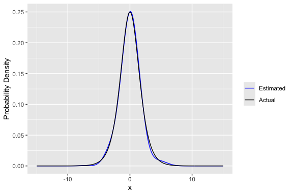
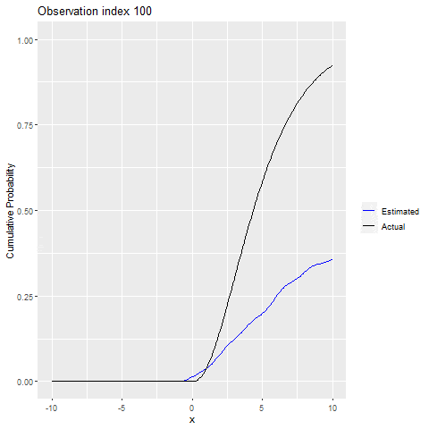
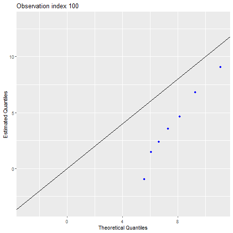

# hermiter

<!-- badges: start -->
[](https://travis-ci.com/MikeJaredS/hermiter)
[](https://codecov.io/gh/MikeJaredS/hermiter)
<!-- badges: end -->


## What does hermiter do?

`hermiter` is an R package that facilitates the estimation of the full 
probability density function, cumulative distribution function and quantile 
function using Hermite series based estimators. The package is applicable to 
streaming (sequential), batch and grouped data. The core methods of the package 
are written in C++ for speed.

These estimators are particularly useful in the sequential setting (both 
stationary and non-stationary data streams). In addition, they are useful in 
efficient, one-pass batch estimation which is particularly relevant in the 
context of large data sets. Finally, the Hermite series based estimators are 
applicable in decentralized (distributed) settings in that estimators formed on 
subsets of the data can be consistently combined. The Hermite series based 
estimators have the distinct advantage of being able to estimate the full 
density function, distribution function and quantile function in an online 
manner.The theoretical and empirical properties of these estimators have been 
studied in-depth in the articles below. The investigations demonstrate that
the Hermite series based estimators are particularly effective in distribution
function and quantile estimation.

* [Stephanou, Michael, Varughese, Melvin and Macdonald, Iain. "Sequential quantiles via Hermite series density estimation." Electronic Journal of Statistics 11.1 (2017): 570-607.](https://projecteuclid.org/euclid.ejs/1488531636) 
* [Stephanou, Michael and Varughese, Melvin. "On the properties of hermite series based distribution function estimators." Metrika (2020).](https://link.springer.com/article/10.1007/s00184-020-00785-z)

## Features

* fast batch estimation of pdf, cdf and quantile function
* consistent combining of estimates on different subsets of a larger data set
* fast sequential estimation of pdf, cdf and quantile function on streaming data
* adaptive sequential estimation on non-stationary streams via exponential 
weighting
* provides online, O(1) time complexity estimates of arbitrary quantiles e.g. 
median at any point in time along with probability densities and cumulative 
probabilities
at arbitrary x
* uses small and constant memory for the estimator
* provides a very compact, simultaneous representation of the pdf, cdf and 
quantile function that can be efficiently stored and communicated using e.g. 
saveRDS and readRDS functions (potentially even suitable for data with privacy 
restrictions since observations are not directly stored in the estimator object)

## Installation

`hermiter` can be installed using `devtools`:

```r
devtools::install_github("MikeJaredS/hermiter")
```

## Load Package

In order to utilize the hermiter package, the package must be loaded using the 
following command:

```{r}
library(hermiter)
```

## Batch Usage

Once the hermite_estimator object has been constructed, it can be updated with a
batch of observations as below.

```r
observations <- rlogis(n=1000)
hermite_est <- hermite_estimator(N=10, standardize=TRUE)
hermite_est <- hermite_est %>% update_batch(observations)
x <- seq(-15,15,0.1)
pdf_est <- dens(hermite_est,x)
cdf_est <- cum_prob(hermite_est,x)
p <- seq(0.05,1,0.05)
quantile_est <- quant(hermite_est,p)
```

```{r}
ggplot(df_pdf_cdf,aes(x=x)) + geom_line(aes(y=pdf_est, colour="Estimated")) +
geom_line(aes(y=actual_pdf, colour="Actual")) +
  scale_colour_manual("", 
                      breaks = c("Estimated", "Actual"),
                      values = c("blue", "black")) + ylab("Probability Density")
```


```{r}
ggplot(df_pdf_cdf,aes(x=x)) + geom_line(aes(y=cdf_est, colour="Estimated")) +
geom_line(aes(y=actual_cdf, colour="Actual")) +
  scale_colour_manual("", 
                      breaks = c("Estimated", "Actual"),
                      values = c("blue", "black")) +
                      ylab("Cumulative Probability")
```


```{r}
ggplot(df_quant,aes(x=actual_quantiles)) + geom_point(aes(y=quantile_est), 
color="blue") + geom_abline(slope=1,intercept = 0) + 
xlab("Theoretical Quantiles") + ylab("Estimated Quantiles")
```


## Sequential Usage

Once the hermite_estimator object has been constructed, it can be updated 
sequentially (one observation at a time) as below.

```{r}
observations <- rlogis(n=1000)
hermite_est <- hermite_estimator(N=10, standardize=TRUE)
for (idx in c(1:length(observations))) {
  hermite_est <- hermite_est %>% update_sequential(observations[idx])
}
```

### Applying to stationary data

The speed of estimation allows the pdf, cdf and quantile functions to be 
estimated in real time. We illustrate this below for cdf and quantile estimation
with a sample Shiny application. We reiterate that the particular usefulness is 
that the full pdf, cdf and quantile functions are updated in real time. Thus, 
any arbitrary quantile can be evaluated at any point in time. We include a stub 
for reading streaming data that generates micro-batches of standard exponential 
i.i.d. random data. This stub can easily be swapped out for a method reading 
micro-batches from a Kafka topic or similar.

The Shiny sample code is included below.

```{r}
# Copy and paste into app.R and run.
library(shiny)
library(hermiter)
library(ggplot2)
library(magrittr)

ui <- fluidPage(
    titlePanel("Streaming Statistics Analysis Example: Exponential 
               i.i.d. stream"),
    sidebarLayout(
        sidebarPanel(
            sliderInput("percentile", "Percentile:",
                        min = 0.01, max = 0.99,
                        value = 0.5, step = 0.01)
        ),
        mainPanel(
           plotOutput("plot"),
           textOutput("quantile_text")
        )
    )
)

server <- function(input, output) {
    values <- reactiveValues(hermite_est = 
                                 hermite_estimator(N = 10, standardize = TRUE))
    x <- seq(-15, 15, 0.1)
    # Note that the stub below could be replaced with code that reads streaming 
    # data from various sources, Kafka etc.  
    read_stream_stub_micro_batch <- reactive({
        invalidateLater(1000)
        new_observation <- rexp(10)
        return(new_observation)
    })
    updated_cdf_calc <- reactive({
        micro_batch <- read_stream_stub_micro_batch()
        for (idx in seq_along(micro_batch)) {
            values[["hermite_est"]] <- isolate(values[["hermite_est"]]) %>%
                update_sequential(micro_batch[idx])
        }
        cdf_est <- isolate(values[["hermite_est"]]) %>%
            cum_prob(x, clipped = TRUE)
        df_cdf <- data.frame(x, cdf_est)
        return(df_cdf)
    })
    updated_quantile_calc <- reactive({
        values[["hermite_est"]]  %>% quant(input$percentile)
    })
    output$plot <- renderPlot({
        ggplot(updated_cdf_calc(), aes(x = x)) + geom_line(aes(y = cdf_est)) +
            ylab("Cumulative Probability")
    }
    )
    output$quantile_text <- renderText({ 
        return(paste(input$percentile * 100, "th Percentile:", 
                     round(updated_quantile_calc(), 2)))
    })
}
shinyApp(ui = ui, server = server)
```


### Applying to non-stationary data

The hermite_estimator is also applicable to non-stationary data streams.
A weighted form of the Hermite series based estimator can be applied to handle 
this case. The estimator will adapt to the new distribution and 
"forget" the old distribution as illustrated in the example below. In this 
example, the  distribution from which the observations are drawn switches from
a Chi-square distribution to a logistic distribution and finally to a normal 
distribution. In order to use the exponentially weighted form of the 
hermite_estimator, the exp_weight_lambda argument must be set to a non-NA value.
Typical values for this parameter are 0.01, 0.05 and 0.1. The lower the 
exponential weighting parameter, the slower the estimator adapts and vice versa 
for higher values of the parameter. However, variance increases with higher 
values of exp_weight_lambda, so there is a trade-off to bear in mind.

```{r}
# Prepare Test Data
num_obs <-2000
test <- rchisq(num_obs,5)
test <- c(test,rlogis(num_obs))
test <- c(test,rnorm(num_obs))
```

```{r}
# Calculate theoretical pdf, cdf and quantile values for comparison
x <- seq(-15,15,by=0.1)
actual_pdf_lognorm <- dchisq(x,5)
actual_pdf_logis <- dlogis(x)
actual_pdf_norm <- dnorm(x)
actual_cdf_lognorm <- pchisq(x,5)
actual_cdf_logis <- plogis(x)
actual_cdf_norm <- pnorm(x)
p <- seq(0.05,0.95,by=0.05)
actual_quantiles_lognorm <- qchisq(p,5)
actual_quantiles_logis <- qlogis(p)
actual_quantiles_norm <- qnorm(p)
```

```{r}
# Construct Hermite Estimator 
h_est <- hermite_estimator(N=20,standardize = T,exp_weight_lambda = 0.005)
```

```{r}
# Loop through test data and update h_est to simulate observations arriving 
# sequentially
count <- 1
res <- data.frame()
res_q <- data.frame()
for (idx in c(1:length(test))) {
  h_est <- h_est %>% update_sequential(test[idx])
  if (idx %% 100 == 0){
    if (floor(idx/num_obs)==0){
      actual_cdf_vals <- actual_cdf_lognorm
      actual_pdf_vals <-actual_pdf_lognorm
      actual_quantile_vals <- actual_quantiles_lognorm
    }
    if (floor(idx/num_obs)==1){
      actual_cdf_vals <- actual_cdf_logis
      actual_pdf_vals <-actual_pdf_logis
      actual_quantile_vals <- actual_quantiles_logis
    }
    if (floor(idx/num_obs)==2){
      actual_cdf_vals <- actual_cdf_norm
      actual_pdf_vals <- actual_pdf_norm
      actual_quantile_vals <- actual_quantiles_norm
    }
    idx_vals <- rep(count,length(x))
    cdf_est_vals <- h_est %>% cum_prob(x, clipped=T)
    pdf_est_vals <- h_est %>% dens(x, clipped=T)
    quantile_est_vals <- h_est %>% quant(p)
    res <- rbind(res,data.frame(idx_vals,x,cdf_est_vals,actual_cdf_vals,
                                pdf_est_vals,actual_pdf_vals))
    res_q <- rbind(res_q,data.frame(idx_vals=rep(count,length(p)),p,
                                    quantile_est_vals,actual_quantile_vals))
    count <- count +1
  }
}
res <- res %>% mutate(idx_vals=idx_vals*100)
res_q <- res_q %>% mutate(idx_vals=idx_vals*100)
```

```{r}
# Visualize Results for PDF (Not run, requires gganimate, gifski and transformr
# packages)
p <- ggplot(res,aes(x=x)) + geom_line(aes(y=pdf_est_vals, colour="Estimated")) + geom_line(aes(y=actual_pdf_vals, colour="Actual")) +
  scale_colour_manual("", 
                      breaks = c("Estimated", "Actual"),
                      values = c("blue", "black")) + ylab("Probability Density") +transition_states(idx_vals,transition_length = 2,state_length = 1) +
  ggtitle('Observation index {closest_state}')
anim_save("pdf.gif",p)
```


```{r}
# Visualize Results for CDF (Not run, requires gganimate, gifski and transformr
# packages)
p <- ggplot(res,aes(x=x)) + geom_line(aes(y=cdf_est_vals, colour="Estimated")) + geom_line(aes(y=actual_cdf_vals, colour="Actual")) +
  scale_colour_manual("", 
                      breaks = c("Estimated", "Actual"),
                      values = c("blue", "black")) +
  ylab("Cumulative Probability") + 
  transition_states(idx_vals, transition_length = 2,state_length = 1) +
  ggtitle('Observation index {closest_state}')
anim_save("cdf.gif", p)
```



```{r}
# Visualize Results for Quantiles (Not run, requires gganimate, gifski and 
# transformr packages)
p <- ggplot(res_q,aes(x=actual_quantile_vals)) +
  geom_point(aes(y=quantile_est_vals), color="blue") +
  geom_abline(slope=1,intercept = 0) +xlab("Theoretical Quantiles") +
  ylab("Estimated Quantiles") + 
  transition_states(idx_vals,transition_length = 2, state_length = 1) +
  ggtitle('Observation index {closest_state}')
anim_save("quant.gif",p)
```


